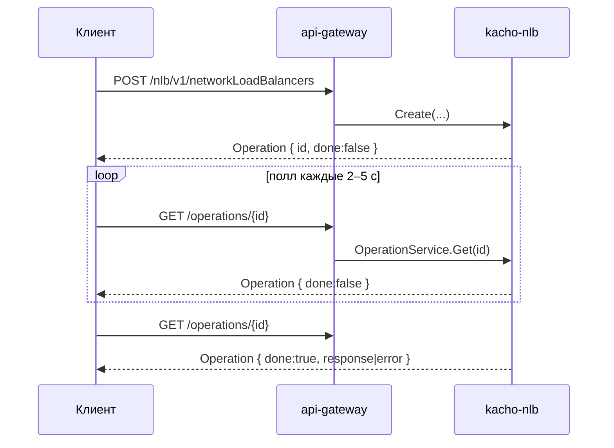

import { ApiOperation } from '@site/src/components/commonBlocks/ApiOperation'
import CodeBlock from '@theme/CodeBlock'
import dedent from 'ts-dedent'

# Операции (Long-Running Operations)

Все **мутации** в Kachō NLB асинхронны: `Create`/`Update`/`Delete` и `:verb`-действия
(`start`, `stop`, `move`, `attachTargetGroup`, `addTargets`, …) возвращают **`Operation`**, а не
ресурс. Так задача «завести балансировщик, выделить VIP, привязать группы, поднять листенеры»
раскладывается на быстрый синхронный приём запроса и фоновую доводку до целевого состояния, а
клиент наблюдает прогресс, опрашивая операцию.

Это конвенция всей платформы Kachō: **read — sync, мутации — async через `Operation`**.
Watch-RPC не существует — клиент **поллит** `OperationService.Get(id)` (обычно каждые 2–5 с) до
`done=true`.

## Модель Operation

<table>
  <thead><tr><th>Поле</th><th>Тип</th><th>Описание</th></tr></thead>
  <tbody>
    <tr><td><code>id</code></td><td>string</td><td>Идентификатор операции (<code>nlb</code>-префикс; по нему api-gateway маршрутизирует опрос)</td></tr>
    <tr><td><code>description</code></td><td>string</td><td>Человекочитаемое описание (например, <code>create network load balancer</code>)</td></tr>
    <tr><td><code>createdAt</code></td><td>timestamp</td><td>Момент постановки операции</td></tr>
    <tr><td><code>createdBy</code></td><td>string</td><td>Инициатор (principal)</td></tr>
    <tr><td><code>modifiedAt</code></td><td>timestamp</td><td>Момент последнего изменения статуса</td></tr>
    <tr><td><code>done</code></td><td>bool</td><td><code>false</code> — в процессе; <code>true</code> — завершена (успех или ошибка)</td></tr>
    <tr><td><code>metadata</code></td><td>Any</td><td>Тип-специфичные метаданные (например, <code>networkLoadBalancerId</code> / <code>targetGroupId</code>)</td></tr>
    <tr><td><code>response</code></td><td>Any</td><td>При успехе — итоговый ресурс (или <code>Empty</code> для Delete/Start/Stop)</td></tr>
    <tr><td><code>error</code></td><td>google.rpc.Status</td><td>При неудаче — код и сообщение в стандартном формате</td></tr>
  </tbody>
</table>

`response` и `error` — взаимоисключающие (`oneof result`): у завершённой операции заполнено
ровно одно из них.

## Get — опросить операцию

<ApiOperation method="GET" endpoint="/operations/{id}">

Возвращает текущее состояние операции. Путь **общий для всей платформы** (`/operations/{id}`,
без `/nlb/v1/`-префикса) — api-gateway направляет запрос в нужный backend по префиксу id.

<CodeBlock language="bash">
  {dedent`
    curl 'http://localhost:18080/operations/nlb...' \\
      -H 'Authorization: Bearer <JWT>'
  `}
</CodeBlock>

Операция ещё в процессе:

<CodeBlock language="json">
  {dedent`
    {
      "id": "nlb...",
      "description": "create network load balancer",
      "done": false,
      "metadata": { "networkLoadBalancerId": "nlb..." }
    }
  `}
</CodeBlock>

Операция завершена успешно (`done=true`, заполнен `response`):

<CodeBlock language="json">
  {dedent`
    {
      "id": "nlb...",
      "description": "create network load balancer",
      "done": true,
      "metadata": { "networkLoadBalancerId": "nlb..." },
      "response": {
        "id": "nlb...",
        "status": "ACTIVE",
        "v4AddressId": "adr..."
      }
    }
  `}
</CodeBlock>

Операция завершена с ошибкой (`done=true`, заполнен `error`):

<CodeBlock language="json">
  {dedent`
    {
      "id": "nlb...",
      "description": "create network load balancer",
      "done": true,
      "error": { "code": 9, "message": "Subnet <id> not found", "details": [] }
    }
  `}
</CodeBlock>

</ApiOperation>

## Опрос истории по ресурсу

Помимо опроса одиночной операции, у каждого ресурса есть `ListOperations` — история его
асинхронных изменений (cursor-пагинация):

<table>
  <thead><tr><th>Ресурс</th><th>REST</th></tr></thead>
  <tbody>
    <tr><td>NetworkLoadBalancer</td><td><code>GET /nlb/v1/networkLoadBalancers/&#123;id&#125;/operations</code></td></tr>
    <tr><td>Listener</td><td><code>GET /nlb/v1/listeners/&#123;id&#125;/operations</code></td></tr>
    <tr><td>TargetGroup</td><td><code>GET /nlb/v1/targetGroups/&#123;id&#125;/operations</code></td></tr>
  </tbody>
</table>

## Паттерн клиента

:::tip Идемпотентность и надёжность
Операции записываются в таблицу `operations` схемы `kacho_nlb` в той же транзакции, что и
lifecycle-событие в outbox — состояние операции переживает рестарт сервиса. При старте сервис
прогоняет recovery незавершённых операций. Подробнее — [Архитектура](/architecture/overview).
:::
