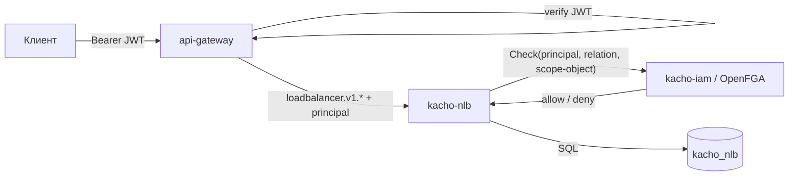

# Авторизация

Эта страница описывает модель доступа Kachō NLB: per-RPC authz-Check через kacho-iam на **обоих**
listener'ах, verb-bearing отношения, scope-filtered List и синхронизацию owner-tuples в OpenFGA.
Общий обзор устройства сервиса — на странице [Архитектура](/architecture/overview).

## AuthN + AuthZ на каждом запросе

Инвариант платформы: **никаких неаутентифицированных и неавторизованных запросов** — ни на
public, ни на internal порту.

- **AuthN** — на edge через `api-gateway` проверяется **JWT** (`Authorization: Bearer`);
  service→service транспорт — **mTLS** (verified client-cert). Internal `:9091` не освобождён:
  mTLS обязателен.
- **AuthZ** — каждый RPC (public и internal) проходит per-RPC `InternalIAMService.Check` в
  kacho-iam (OpenFGA / ReBAC). Internal-периметр **не считается доверенным**
  (defense-in-depth против lateral movement).

## Verb-bearing отношения

Каждый RPC в proto несёт аннотации `permission`, `required_relation` и `scope_extractor` (по
какому объекту и его типу проверять доступ). Отношения — **verb-bearing** (развязаны с общим
tier'ом): доступ к конкретному действию проверяется точечно.

| Действие | required_relation | scope-объект |
|---|---|---|
| `Get`, `GetTargetStates` | `v_get` | сам ресурс (`lb_network_load_balancer` / `lb_listener` / `lb_target_group`) |
| `ListOperations` | `v_list` | сам ресурс |
| `Update`, `Start`, `Stop`, `Move`, `Attach…`/`Detach…`, `Add…`/`Remove…` | `v_update` | сам ресурс |
| `Delete` | `v_delete` | сам ресурс |
| `Create` | `editor` | родитель: `project` (NLB, TargetGroup) или `lb_network_load_balancer` (Listener) |

Для `Create` листенера scope — **родительский балансировщик**, а не проект: `lb_listener`
наследует доступ от `lb_network_load_balancer` (иерархия tuple
`lb_listener#load_balancer@lb_network_load_balancer:<lb_id>`).

Нет нужного отношения → `PERMISSION_DENIED` (HTTP 403). Недоступность kacho-iam на request-path
→ `UNAVAILABLE` (fail-closed).

## Scope-filtered List

`List`-RPC всех трёх сервисов освобождены (`<exempt>`) от единого project-scope Check — вместо
этого handler фильтрует результат через `AuthorizeService.ListObjects` (viewer ∪ `v_list`,
per-object). Причина: единый project-scope Check отклонил бы viewer'а без отдельного `v_list`-
tuple ещё до фильтра. AuthN (JWT) при этом остаётся обязательным.

Фильтр — **read == enforce**: отдаётся только то, что реально видно вызывающему. При
недоступности kacho-iam List возвращает `UNAVAILABLE` (fail-closed, не нефильтрованный ответ) —
конфигурируется `authz.list-filter.fail-open: false`.

## Owner-tuples в OpenFGA

FGA-объектные типы домена: `lb_network_load_balancer`, `lb_listener`, `lb_target_group`. При
создании ресурса сервис через `InternalIAMService.RegisterResource` записывает hierarchy/owner-
tuples (project / owner) в OpenFGA — модули не ходят в FGA напрямую, только через kacho-iam.

Доставка идемпотентна и at-least-once через **transactional outbox**: tuple-намерение пишется в
`kacho_nlb.fga_register_outbox` в той же транзакции, что и ресурс; corelib-drainer (канал
`kacho_nlb_fga_register_outbox`) досылает его в kacho-iam с ретраями.

:::note Domain-binding: object-префикс ≠ имя сервиса
Сервис `kacho-nlb` владеет FGA-доменом с префиксом **`lb_`** (не `nlb_`). kacho-iam при
валидации proxy-tuple биндит caller-домен (из mTLS SAN) к object-префиксу через явный mapping
(`nlb` → `lb`). Это важно под production-strict mTLS: без корректного mapping'а owner-tuples
были бы отклонены и ресурсы стали бы невидимы в authz-filtered List.
:::

:::warning Least-privilege proxy-tuples
Через `RegisterResource` модуль вправе писать **только** hierarchy-отношения
(`project`/`owner`), но не `admin`/`editor`/`viewer` — это защита от privilege-escalation,
энфорсится в kacho-iam. Модель ресурса обязана иметь `owner`-relation, иначе creator-tuple
застрянет неотправленным в outbox.
:::
