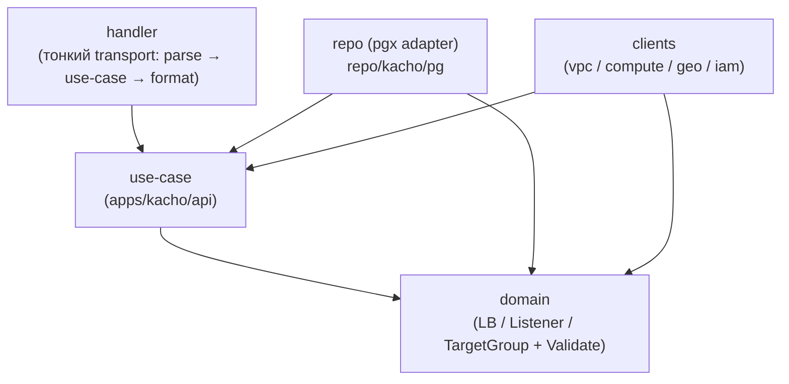
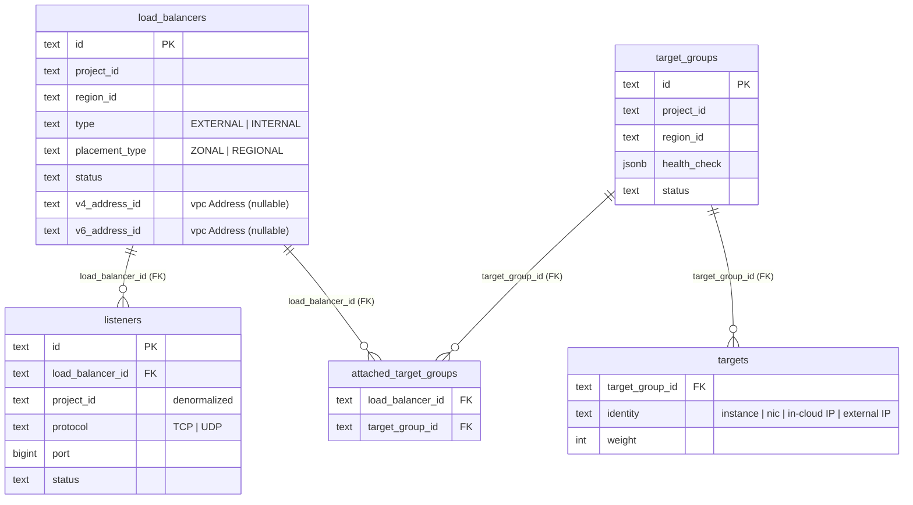
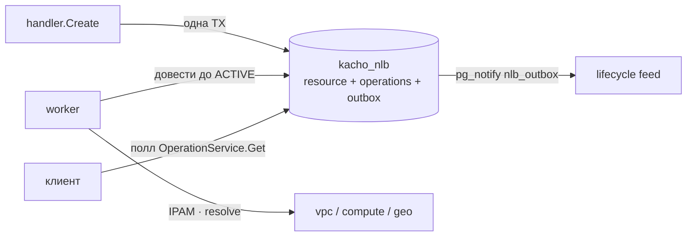

import CodeBlock from '@theme/CodeBlock'
import dedent from 'ts-dedent'

# Архитектура

Эта страница описывает внутреннее устройство Kachō NLB: слоистую (clean) архитектуру, схему БД
(database-per-service), async-модель через outbox и LRO, cross-domain-рёбра и место сервиса в
платформе. VIP-модель и размещение вынесены на отдельную страницу
[VIP и размещение](/architecture/vip-model), авторизация — на [Авторизацию](/architecture/authz).
Внешний контракт — на [страницах API](/api/overview).

## Чистая архитектура

Сервис следует строгому правилу зависимостей: транспорт зависит от бизнес-логики, бизнес-логика
зависит от домена, а домен не зависит ни от чего, кроме stdlib и контракта `kacho-proto`.

<table>
  <thead><tr><th>Слой</th><th>Где</th><th>Ответственность</th></tr></thead>
  <tbody>
    <tr><td><strong>domain</strong></td><td><code>internal/domain/</code></td><td>Сущности + <code>Validate()</code>, self-validating value-типы. Только stdlib + proto</td></tr>
    <tr><td><strong>use-case</strong></td><td><code>internal/apps/kacho/api/</code></td><td>Бизнес-логика; определяет port-интерфейсы (Repo, peer-Client). Не импортирует transport</td></tr>
    <tr><td><strong>repo (adapter)</strong></td><td><code>internal/repo/kacho/pg/</code></td><td>Handwritten pgx; SQLSTATE → sentinel; outbox-emit в TX</td></tr>
    <tr><td><strong>clients (adapter)</strong></td><td><code>internal/clients/</code></td><td>gRPC-клиенты к vpc / compute / geo / iam</td></tr>
    <tr><td><strong>handler</strong></td><td><code>internal/handler/</code></td><td>Тонкий transport: parse → use-case → format. Без бизнес-логики</td></tr>
    <tr><td><strong>jobs</strong></td><td><code>internal/apps/kacho/jobs/</code></td><td>Фоновые worker'ы (target-drain runner, free-ip reconciler)</td></tr>
    <tr><td><strong>composition root</strong></td><td><code>cmd/kacho-loadbalancer/</code></td><td>Единственное место wiring; <code>cmd/migrator/</code> — миграции</td></tr>
  </tbody>
</table>

Переиспользуемое (pgx-пул, grpc-сервер/клиент, `operations` LRO-таблица, outbox/drainer, config,
observability) приходит из `kacho-corelib` — не дублируется в сервисе.

## База данных — database-per-service

Kachō NLB владеет схемой `kacho_nlb` в PostgreSQL и не делит её ни с кем. Within-service
инварианты выражены **на уровне БД** (FK / UNIQUE / атомарный CAS), а не software-проверками.

<table>
  <thead><tr><th>Таблица</th><th>Назначение</th><th>Ключевые ограничения</th></tr></thead>
  <tbody>
    <tr><td><code>load_balancers</code></td><td>Балансировщики</td><td>Один Address на семейство (кардинальность строки + CAS-attach VIP)</td></tr>
    <tr><td><code>listeners</code></td><td>Листенеры</td><td>FK <code>load_balancer_id</code>; UNIQUE(load_balancer_id, name)</td></tr>
    <tr><td><code>target_groups</code></td><td>Группы таргетов</td><td>Embedded <code>health_check</code> (JSONB)</td></tr>
    <tr><td><code>attached_target_groups</code></td><td>Pivot M:N членства</td><td>Источник истины привязки LB ↔ TG</td></tr>
    <tr><td><code>targets</code></td><td>Таргеты групп</td><td>FK <code>target_group_id</code>; двухфазный drain</td></tr>
    <tr><td><code>operations</code></td><td>LRO (corelib)</td><td>Идемпотентность + recovery на старте</td></tr>
    <tr><td>outbox-таблицы</td><td>lifecycle-feed + FGA register</td><td>LISTEN/NOTIFY-триггеры</td></tr>
  </tbody>
</table>

:::note Инварианты — на DB-уровне (не software check-then-act)
Смена владения VIP (attach Address к балансировщику) и членство групп выражены атомарным
`UPDATE … WHERE <expected>` (CAS) либо UNIQUE/FK, а не software `Get → check → Update`. Service-
слой только маппит SQLSTATE на gRPC-код (`23503`→FailedPrecondition, `23505`→AlreadyExists,
`23514`→InvalidArgument). Текст pgx наружу не утекает (→ фиксированный INTERNAL).
:::

## Async-модель: Operation + outbox

Мутация принимается синхронно (валидация + запись «намерения» + постановка операции), а доводка
до целевого состояния выполняется воркером. В **одной writer-транзакции** пишутся: изменение
ресурса, строка `operations` (LRO) и строка lifecycle-outbox. Триггер на INSERT шлёт
`pg_notify` в канал `nlb_outbox` — подписчики (в т.ч. UI-feed) узнают о событиях без поллинга.

Отдельный **FGA register-outbox** (канал `kacho_nlb_fga_register_outbox`) через corelib
drainer доставляет owner/hierarchy-tuples в OpenFGA через kacho-iam (at-least-once,
идемпотентно). Подробнее — [Авторизация](/architecture/authz).

:::warning Principal в фоновом воркере
Async-воркер запускается в detached-контексте; чтобы cross-service вызовы (vpc/compute/geo/iam)
не ушли анонимными, воркер принудительно инжектит principal, захваченный на sync-этапе, и
оборачивает исходящий контекст `auth.PropagateOutgoing`. Detached фоновые loops (drain-runner,
free-ip reconciler) работают под явным SA-principal.
:::

## Cross-domain рёбра

Через границу сервиса FK невозможен (database-per-service). Ссылки на чужие ресурсы — обычный
текст (без FK), валидируемый через API владельца на request-path.

<table>
  <thead><tr><th>Ребро</th><th>Зачем</th><th>Направление</th></tr></thead>
  <tbody>
    <tr><td><code>nlb → kacho-geo</code></td><td><code>RegionService.Get</code> — валидация <code>regionId</code></td><td>sync precheck</td></tr>
    <tr><td><code>nlb → kacho-vpc</code></td><td>Address / Subnet / NIC: IPAM-аллокация VIP, валидация ссылок таргетов</td><td>sync + IPAM</td></tr>
    <tr><td><code>nlb → kacho-compute</code></td><td><code>InstanceService.Get</code> — резолв Instance-таргетов</td><td>sync</td></tr>
    <tr><td><code>nlb → kacho-iam</code></td><td><code>ProjectService.Get</code> (existence), <code>InternalIAMService.Check</code> (authz), <code>RegisterResource</code> (FGA owner-tuples)</td><td>sync + drainer</td></tr>
  </tbody>
</table>

Все рёбра **однонаправлены** (`nlb → *`); ни vpc, ни compute, ни geo, ни iam не зовут nlb
обратно — циклов в графе нет. При удалении чужого ресурса owner **не** спрашивает nlb (нет
cross-service cascade): nlb обязан грациозно переживать dangling-ссылку (деградированный статус,
не паника). Жёсткие гарантии целостности — только within-service (FK/UNIQUE/CAS).

:::info Denormalized mirror-поля
Показать имя/IP чужого ресурса (например, IP связанного Address) — output-only проекция,
помеченная «source of truth = &lt;owner&gt;.&lt;Resource&gt;». Такие зеркала пишутся на
write-time (при set-reference), не резолвятся на чтении, и не подаются на вход Create/Update.
:::
