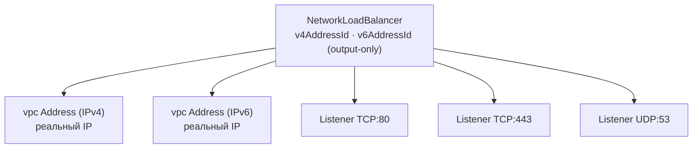
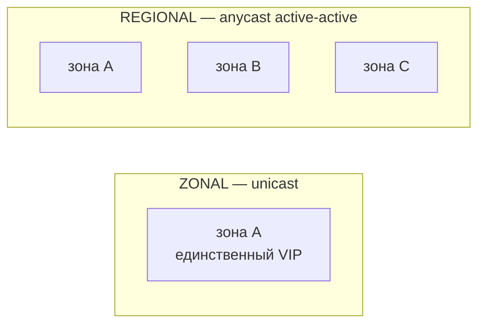
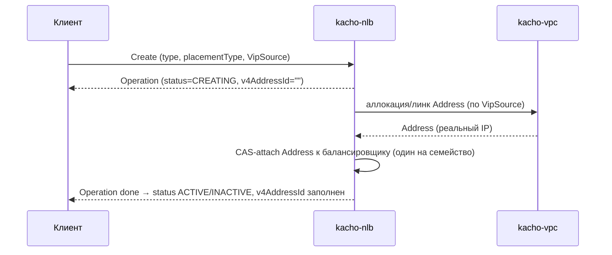

# VIP и размещение

Эта страница объясняет ключевое проектное решение Kachō NLB: **как балансировщик получает
виртуальный адрес (VIP) и как трафик распределяется по зонам**. Это собственная модель Kachō —
она сознательно устроена так, чтобы адрес был единой, стабильной точкой входа, а размещение
не «протекало» в публичную поверхность.

## Один VIP на балансировщик на семейство

VIP принадлежит **балансировщику**, а не листенеру. На одном балансировщике может быть много
[Listener](/api/listener)'ов (разные порты/протоколы), но все они делят **один** адрес на
семейство: до одного IPv4 и до одного IPv6. Листенер собственного адреса не несёт.

Зачем так: одна DNS-запись / один анонсируемый адрес на сервис — устойчивая, предсказуемая
точка входа; мультиплексирование по портам делают листенеры. Это упрощает и tenant-модель
(«у моего сервиса один адрес»), и data plane (анонсируется один префикс).

Сам IP-адрес хранится в связанном vpc `Address` (получается через `vpc.AddressService.Get` по
`v4AddressId` / `v6AddressId`), а не дублируется в балансировщике. Пока `status=CREATING`,
`v4AddressId`/`v6AddressId` пусты — это durable-handle до момента bind воркером.

## VipSource — источник адреса

Адрес задаётся **пофамильно** на Create через `VipSource` (`v4Source` / `v6Source`), хотя бы
одно семейство обязательно. Источник неизменяем после Create; наружу выставляются output-only
`v4AddressId` / `v6AddressId`.

| Источник (`oneof source`) | Что делает | Для какого типа |
|---|---|---|
| `subnetId` | Авто-аллокация свежего внутреннего Address из подсети | INTERNAL |
| `addressId` | Линк существующего vpc Address (kind соответствует type) | EXTERNAL / INTERNAL |
| `public: {}` | Платформенный public-адрес (auto-alloc) | EXTERNAL |

Балансировщик, создавший Address авто-аллокацией, при удалении **освобождает** его; линкованный
(`addressId`) Address остаётся владению пользователя.

## Тип: EXTERNAL vs INTERNAL

| Тип | Адрес | `placementType` |
|---|---|---|
| `EXTERNAL` | Публичный адрес (link существующего либо `public` auto-alloc) | не применяется (пуст) |
| `INTERNAL` | Внутренний адрес из подсети / линк internal Address | **обязателен и явен**: ZONAL или REGIONAL |

`placementType` для EXTERNAL **запрещён**, для INTERNAL — **обязателен**. Поле immutable после
Create.

## Размещение INTERNAL: ZONAL vs REGIONAL

Внутренний балансировщик размещается одним из двух способов:

- **ZONAL** — unicast-VIP в **одной** зоне (зональная подсеть/адрес). Простейший вариант: один
  адрес живёт в одной зоне.
- **REGIONAL** — anycast-VIP, привязанный к **региону** (региональная подсеть/адрес). Один и тот
  же адрес анонсируется active-active из **здоровых зон** региона; при отказе зоны трафик
  естественно уходит в оставшиеся. Реальный анонс/withdraw — задача data plane; control plane
  фиксирует только намерение.

### disabledAnnounceZones — drain зоны

Для REGIONAL поле `disabledAnnounceZones` (mutable) — deny-list зон, из которых anycast-VIP
**не** анонсируется. Пустой список = анонс из всех здоровых зон. Так можно вывести зону из
ротации (drain) без пересоздания балансировщика. Каждая зона списка обязана принадлежать
региону балансировщика, и список не может покрыть все зоны (иначе анонсировать неоткуда).
Реальный withdraw выполняет data plane — здесь фиксируется intent.

:::note Инфра-детали размещения — не на публичной поверхности
Публичная поверхность балансировщика показывает tenant-facing намерение и результат: id, имя,
метки, тип, размещение, привязки, статус и **id связанного Address** (сам IP берётся из vpc).
То, как VIP разложен по конкретному железу/underlay зон, на публичный API не выносится
(defense-in-depth: публичный API не должен раскрывать физическую топологию). Это тот же принцип,
что и в остальной платформе Kachō.
:::

## Жизненный цикл VIP при Create

До завершения операции `v4AddressId`/`v6AddressId` пусты. После bind балансировщик переходит в
`ACTIVE` (если есть активные листенеры и привязанные группы) либо `INACTIVE` (пока их нет).
