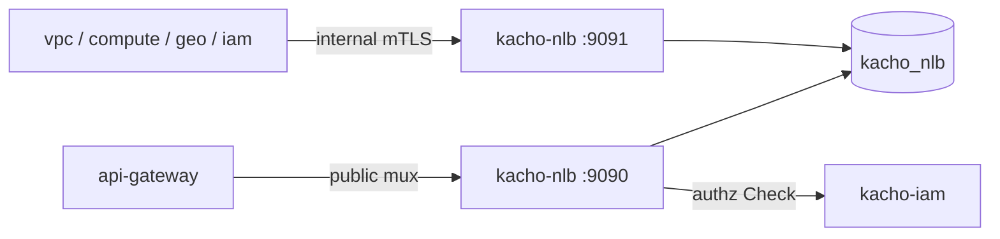

import CodeBlock from '@theme/CodeBlock'
import dedent from 'ts-dedent'

# Развёртывание

Эта страница описывает сборку Kachō NLB, применение миграций, два listener'а, фоновые worker'ы и
контейнерный образ. Ключи конфигурации — на странице [Конфигурация](/install/configuration).

## Сборка

В репозитории две сборочные цели: API-сервер и отдельный бинарь миграций.

<CodeBlock language="bash">
  {dedent`
    # API-сервер → bin/kacho-loadbalancer
    make build-api

    # мигратор → bin/kacho-migrator
    make build-migrator

    # обе цели
    make build
  `}
</CodeBlock>

## Миграции

Схема `kacho_nlb` управляется goose-миграциями (`internal/migrations`, встроены в бинарь).
Применяются **отдельным** бинарём `bin/kacho-migrator` (не самим сервисом на старте). DSN
берётся по приоритету `--dsn` > ENV `KACHO_NLB_REPOSITORY__POSTGRES__URL` > `config.yaml`.

<CodeBlock language="bash">
  {dedent`
    export KACHO_NLB_REPOSITORY__POSTGRES__URL='postgres://kacho:secret@pg:5432/kacho_nlb?sslmode=disable&search_path=kacho_nlb,public'

    make migrate-up        # bin/kacho-migrator up
    make migrate-status    # bin/kacho-migrator status
    make migrate-down      # откат последней
  `}
</CodeBlock>

:::warning Применённую миграцию не редактировать
Изменение схемы — только новой миграцией. Уже применённый файл не редактируется (конвенция
Kachō).
:::

## Запуск — два listener'а

API-сервер поднимает два независимых gRPC-listener'а:

<table>
  <thead><tr><th>Listener</th><th>Endpoint (дефолт)</th><th>Назначение</th></tr></thead>
  <tbody>
    <tr><td>public</td><td><code>tcp://0.0.0.0:9090</code></td><td>Клиенты + UI через api-gateway: CRUD + lifecycle</td></tr>
    <tr><td>internal</td><td><code>tcp://0.0.0.0:9091</code></td><td>Cluster-internal (mTLS): peer-сервисы, lifecycle-стрим FGA-синхронизации</td></tr>
  </tbody>
</table>

Дополнительно поднимаются метрики (`/metrics`, порт `:9101`) и gRPC health-check. В production
оба listener'а обязаны работать по mTLS, а адрес kacho-iam для per-RPC authz — быть
сконфигурированным (иначе валидация конфига не пройдёт).

## Фоновые worker'ы

Кроме обработки RPC сервис держит фоновые job'ы:

<table>
  <thead><tr><th>Worker</th><th>Что делает</th><th>Период (дефолт)</th></tr></thead>
  <tbody>
    <tr><td>target-drain runner</td><td>Двухфазный drain: удаляет истёкшие DRAINING-таргеты, эмитит lifecycle-событие группы</td><td>10s</td></tr>
    <tr><td>free-ip reconciler</td><td>Реконсайл застрявших балансировщиков/листенеров (create-orphan CREATING, незавершённый DELETING)</td><td>30s (порог возраста 5m)</td></tr>
    <tr><td>FGA register-drainer</td><td>Досылает owner/hierarchy-tuples в kacho-iam из <code>fga_register_outbox</code></td><td>по NOTIFY</td></tr>
  </tbody>
</table>

## Boot-gate REQUIRE_IAM

Fail-closed boot-gate: при `KACHO_NLB_REQUIRE_IAM=true` мутирующий `Create` отклоняется, а
readiness остаётся `NotReady`, пока сервис не убедился, что kacho-iam достижим (FGA-подключение
поднято). Так сервис не принимает мутации, для которых не сможет записать owner-tuples.
Production-профиль включает этот флаг.

## Контейнерный образ

<CodeBlock language="bash">
  {dedent`
    make docker    # собрать образ kacho-nlb
  `}
</CodeBlock>

При развёртывании в кластер мигратор обычно запускается отдельным job/init-контейнером
(`kacho-migrator up`) до старта сервиса, а сам сервис — как Deployment с портами public/internal
и метриками.

:::tip Дальше
Полный список ключей конфигурации, режимы и per-edge mTLS — [Конфигурация](/install/configuration).
Первые запросы к запущенному сервису — [Быстрый старт](/getting-started).
:::
