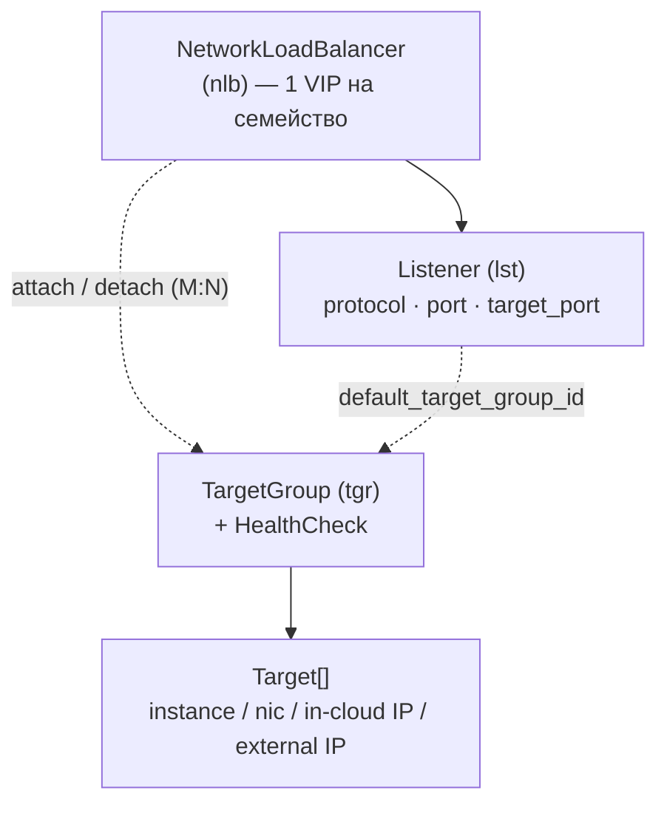
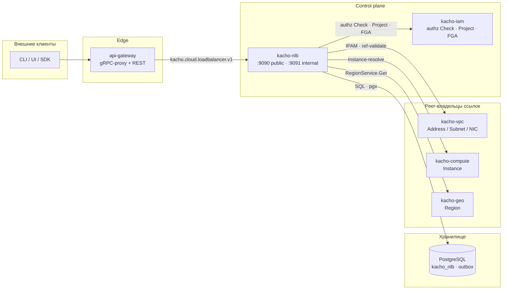

import hero from '@site/src/css/hero.module.css'

<header className={hero.hero}>
   Control-plane · Load Balancing

  <h1 className={hero.title}>
    L4-балансировщик нагрузки 
    Kachō
  </h1>

  

    gRPC + REST API управления сетевыми балансировщиками уровня L4:
    <strong>NetworkLoadBalancer</strong>, <strong>Listener</strong> и <strong>TargetGroup</strong>.
    Один VIP на балансировщик, health-check на группе таргетов, зональное и региональное
    (anycast) размещение.
  

  

    <a className={hero.btnPrimary} href="/getting-started">Быстрый старт →</a>
    <a className={hero.btnGhost} href="/api/overview">Обзор API</a>
    <a className={hero.btnGhost} href="/architecture/overview">Архитектура</a>
    <a className={hero.btnGhost} href="https://github.com/PRO-Robotech/kacho-nlb">GitHub</a>
  

</header>

## Что это и зачем

**Kachō NLB** — control-plane сервис домена **Load Balancing**. Он решает базовую задачу
эксплуатации: *распределить входящий L4-трафик (TCP / UDP) на набор бэкендов и убирать из
ротации нездоровые из них*. Пользователь описывает **намерение** — какой порт слушать, куда
пересылать, как проверять здоровье таргетов, — а сервис управляет жизненным циклом
балансировщика: выделяет VIP, следит за статусами, атомарно применяет изменения.

Бизнес-ценность в том, что балансировщик — **декларативный ресурс платформы**, а не набор
руками настроенных правил. Приложение объявляет TargetGroup (пул бэкендов + health-check),
поднимает NetworkLoadBalancer с одним публичным или внутренним адресом и вешает на него
Listener'ы. Дальше платформа сама держит соответствие «намерение → факт»: пересобирает
состояние при добавлении/удалении таргетов, при переносе между проектами, при остановке и
запуске.

API следует **конвенциям Kachō**: плоские (flat) ресурсы, camelCase JSON, REST-пути
`/nlb/v1/<resource>`, единый формат ошибок `{code, message, details[]}`. Чтение — синхронное;
все мутации — асинхронные и возвращают [`Operation`](/api/operations), который клиент поллит
до `done`.

:::info Control-plane only
Kachō NLB управляет **описанием балансировщиков** (VIP, listeners, target groups, статусы) —
это control plane. Программирование форвардинга и реальный отвод трафика (announce/withdraw
anycast-VIP, drain соединений) выполняет data plane; здесь фиксируется только намерение.
Эта документация описывает control-plane API.
:::

:::tip С чего начать
Новому читателю — [**Быстрый старт**](/getting-started): пошагово от TargetGroup и
NetworkLoadBalancer до Listener и опроса состояния таргетов через `curl`. Дальше —
[Обзор API](/api/overview) и [Архитектура](/architecture/overview).
:::

## Доменная модель

Kachō NLB управляет **тремя типами ресурсов**. Все — плоские (flat): domain-поля на верхнем
уровне сообщения, без K8s-envelope (`metadata`/`spec`/`status`). Каждый ресурс принадлежит
проекту (`projectId`) и региону (`regionId`).

<table>
  <thead>
    <tr><th>Ресурс</th><th>ID-префикс</th><th>REST namespace</th><th>Назначение</th></tr>
  </thead>
  <tbody>
    <tr><td><strong>NetworkLoadBalancer</strong></td><td><code>nlb</code></td><td><code>/nlb/v1/networkLoadBalancers</code></td><td>L4-балансировщик: один VIP на семейство адресов, тип EXTERNAL / INTERNAL, размещение ZONAL / REGIONAL</td></tr>
    <tr><td><strong>Listener</strong></td><td><code>lst</code></td><td><code>/nlb/v1/listeners</code></td><td>Точка приёма трафика балансировщика: протокол (TCP/UDP), входящий порт, порт таргета, default target group</td></tr>
    <tr><td><strong>TargetGroup</strong></td><td><code>tgr</code></td><td><code>/nlb/v1/targetGroups</code></td><td>Пул L4-бэкендов с единым embedded health-check; привязывается к балансировщику M:N</td></tr>
  </tbody>
</table>

:::note Идентификаторы — серверные
Идентификаторы ресурсов генерирует сервер (`kacho-corelib/ids`): 3-символьный префикс +
17-символьный crockford-base32. Тип ресурса читается по префиксу (`nlb` / `lst` / `tgr`).
Идентификатор операции несёт тот же `nlb`-префикс — по нему api-gateway маршрутизирует опрос
`OperationService.Get`.
:::

### Связи ресурсов

- **Listener → LoadBalancer** — жёсткая композиция: листенер создаётся под конкретный
  балансировщик (`load_balancer_id`, FK), наследует его VIP и не несёт собственного адреса.
- **LoadBalancer ↔ TargetGroup** — связь M:N через attach/detach: одну группу можно повесить
  на несколько балансировщиков, и наоборот. Источник истины членства — DB-pivot.
- **Target** — элемент группы; идентичность задаётся одной из четырёх форм (Instance / NIC /
  внутрицловый IP в подсети / внешний IP), см. [TargetGroup](/api/target-group).

## Как с сервисом общаться

Kachō NLB — доменный сервис платформы. Tenant-запросы проходят через `api-gateway`; сам
сервис на request-path обращается к соседним доменам для валидации ссылок и авторизации.

Система построена по принципу **database-per-service**: kacho-nlb владеет схемой `kacho_nlb` и
общается с другими доменами только по API (никаких cross-service FK). Ссылки на чужие ресурсы
(`subnetId`, `instanceId`, `regionId`, `projectId`) — обычный текст, который валидируется через
API владельца на request-path. Подробнее — [Архитектура](/architecture/overview).

## Ключевые возможности

  

    ⇄
    gRPC + REST API
    Единый контракт на Protocol Buffers (<code>kacho-proto</code>, домен <code>kacho.cloud.loadbalancer.v1</code>), REST-проекция через grpc-gateway.
  

  

    ◎
    Один VIP на балансировщик
    VIP задаётся пофамильно (v4/v6) на балансировщике через VipSource; листенеры делят его.
  

  

    ◧
    ZONAL / REGIONAL
    Внутренний LB: unicast в одной зоне либо anycast active-active из здоровых зон региона.
  

  

    ♥
    Health-check на группе
    Единый TCP/HTTP health-check на TargetGroup; per-target вес и статусы через GetTargetStates.
  

  

    ⟳
    Async Operation
    Каждая мутация возвращает <code>Operation</code>; клиент поллит <code>OperationService.Get</code> до <code>done</code>.
  

  

    🔑
    Авторизация на обоих портах
    Per-RPC authz Check через kacho-iam (ReBAC/OpenFGA) — и на public (:9090), и на internal (:9091).
  

## Технологический стек

<table>
  <thead><tr><th>Технология</th><th>Применение</th></tr></thead>
  <tbody>
    <tr><td>Go</td><td>Язык реализации (чистая архитектура: handler → use-case → domain)</td></tr>
    <tr><td>Protocol Buffers / Buf</td><td>Контракт API (<code>kacho-proto</code>, домен <code>kacho.cloud.loadbalancer.v1</code>)</td></tr>
    <tr><td>PostgreSQL / pgx v5</td><td>Хранилище <code>kacho_nlb</code></td></tr>
    <tr><td>Goose</td><td>Версионирование схемы (отдельный <code>cmd/migrator</code>)</td></tr>
    <tr><td>sqlc + handwritten pgx</td><td>SQL-доступ (без ORM)</td></tr>
    <tr><td>OpenFGA (ReBAC)</td><td>Авторизация — per-RPC Check + hierarchy-tuples через kacho-iam</td></tr>
    <tr><td>grpc-gateway</td><td>REST-проекция gRPC</td></tr>
  </tbody>
</table>

## Структура репозиториев

<table>
  <thead><tr><th>Репозиторий</th><th>Назначение</th></tr></thead>
  <tbody>
    <tr><td><strong>kacho-nlb</strong></td><td>Этот сервис: control-plane Load Balancing (NLB / Listener / TargetGroup)</td></tr>
    <tr><td><strong>kacho-proto</strong></td><td>Центральные <code>.proto</code> + сгенерированные Go-stubs</td></tr>
    <tr><td><strong>kacho-corelib</strong></td><td>Общие пакеты (db, grpcsrv, grpcclient, operations, outbox, config, ...)</td></tr>
    <tr><td><strong>kacho-api-gateway</strong></td><td>Edge: gRPC-proxy + REST mux</td></tr>
    <tr><td><strong>kacho-iam</strong></td><td>Авторизация (Check), ProjectService, FGA owner-tuples</td></tr>
    <tr><td><strong>kacho-vpc / kacho-compute / kacho-geo</strong></td><td>Владельцы ссылок: Address/Subnet/NIC · Instance · Region</td></tr>
  </tbody>
</table>
